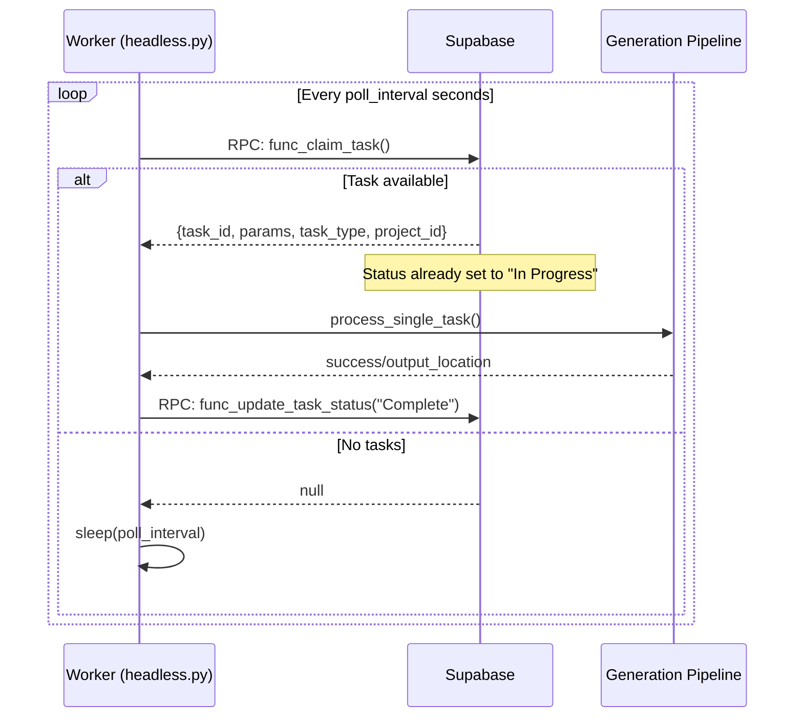

# Headless Worker – Supabase Task Processing

_Status: **Draft v0.2** – Implementation in progress_

## 1 Purpose
Extend `headless.py` so the exact same binary can be pointed at either the local SQLite queue **or** a remote Supabase project.  When supplied with a Supabase URL + access token it should:

1. Poll the `public.tasks` table for rows whose `status = 'Queued'`.
2. Claim a task (atomically set `status = 'In Progress'`).
3. Run the existing generation pipeline.
4. Write the results back to the same row (`status = 'Complete'`, `output_location`, `generation_processed_at`, etc.).

Row-Level-Security will ensure a **user-scoped token** only sees their own tasks, while a **service-role/admin token** sees the entire queue.  No extra filtering is done by the headless worker – it trusts the DB/RLS to return the correct set.

## 2 Usage

```bash
# User token (only sees their tasks)
python headless.py --db-type supabase \
  --supabase-url https://xyz.supabase.co \
  --supabase-access-token eyJhbGciOi...

# Service-role token (sees all tasks)
python headless.py --db-type supabase \
  --supabase-url https://xyz.supabase.co \
  --supabase-access-token eyJhbGciOi...SERVICE_ROLE_KEY...
```

## 3 Token Types & RLS Behavior

| Token Type | What it sees | Use case |
|------------|--------------|----------|
| **User JWT** (from login or PAT) | Only tasks where `user_id = auth.uid()` | Individual users running their own worker |
| **Service-role key** | All tasks (bypasses RLS) | Central server processing everyone's tasks |

## 4 Database Schema Requirements

The Supabase `tasks` table must have these columns:
- `id` (text, primary key)
- `task_type` (text)
- `params` (jsonb)
- `status` (text) – values: `"Queued"`, `"In Progress"`, `"Complete"`, `"Failed"`, `"Cancelled"`
- `dependant_on` (text, nullable)
- `output_location` (text, nullable)
- `created_at` (timestamptz)
- `updated_at` (timestamptz)
- `project_id` (text, foreign key to projects.id)
- `generation_processed_at` (timestamptz, nullable)

## 5 Required Supabase RPC Functions

The implementation relies on these RPC functions being present in Supabase:

### 5.1 `func_claim_task`
Claims the oldest queued task atomically. Must return:
- `task_id_out`
- `params_out` (as JSONB)
- `task_type_out`
- `project_id_out` ⚠️ **Currently missing from RPC – needs to be added**

### 5.2 `func_update_task_status`
Updates task status and optionally output_location.

### 5.3 Other RPCs
- `func_initialize_tasks_table`
- `func_migrate_tasks_for_task_type`
- `func_add_task`
- `func_get_completed_generation_segments_for_stitch`

## 6 Polling & Processing Flow



## Implementation Status

### ✅ **COMPLETED**
- [x] CLI argument parsing (`--db-type`, `--supabase-url`, `--supabase-access-token`)
- [x] Backend abstraction layer (SQLite vs Supabase)
- [x] Supabase task polling and claiming via RPC
- [x] Status updates ("Queued" → "In Progress" → "Complete"/"Failed")
- [x] **NEW**: Automatic file upload to Supabase Storage
- [x] **NEW**: Public URL storage in `output_location` field
- [x] **NEW**: Support for `image_uploads` bucket (configurable via `SUPABASE_VIDEO_BUCKET`)
- [x] Test script (`test_supabase_headless.py`)
- [x] Documentation (`SUPABASE_SETUP.md`)

### ⚠️ **NEEDS VERIFICATION**
- [ ] RPC function `func_claim_task` needs to return `project_id_out` parameter
- [ ] Supabase Storage bucket (`image_uploads`) must be created and configured
- [ ] Row-Level-Security policies must be properly configured
- [ ] Test with both user tokens and service-role tokens

### 📝 Future Enhancements
- [ ] Worker heartbeat/health checks
- [ ] Multiple worker coordination
- [ ] Task priority handling
- [ ] Retry logic for failed tasks
- [ ] Metrics/monitoring integration

## 8 Testing Checklist

- [ ] Test with user JWT (should only see user's tasks)
- [ ] Test with service-role key (should see all tasks)
- [ ] Test task claiming is atomic (no double-processing)
- [ ] Test network failure recovery
- [ ] Test file upload to Supabase storage
- [ ] Test with various task types (single_image, travel_orchestrator, etc.)

## 9 Security Considerations

1. **Never expose service-role key** to end users
2. **Validate JWT expiry** and handle refresh if needed
3. **Ensure RLS policies** are correctly configured on the tasks table
4. **Use HTTPS** for all Supabase connections
5. **Store tokens securely** (environment variables, not in code)

## 10 Migration from SQLite

For existing SQLite users:
1. Export tasks from SQLite
2. Transform to match Supabase schema
3. Import via Supabase dashboard or API
4. Update any hardcoded file paths to URLs
5. Switch `--db-type` flag to `supabase`

---

_Last updated: Implementation in progress, core functionality working but needs RPC update for project_id_ 